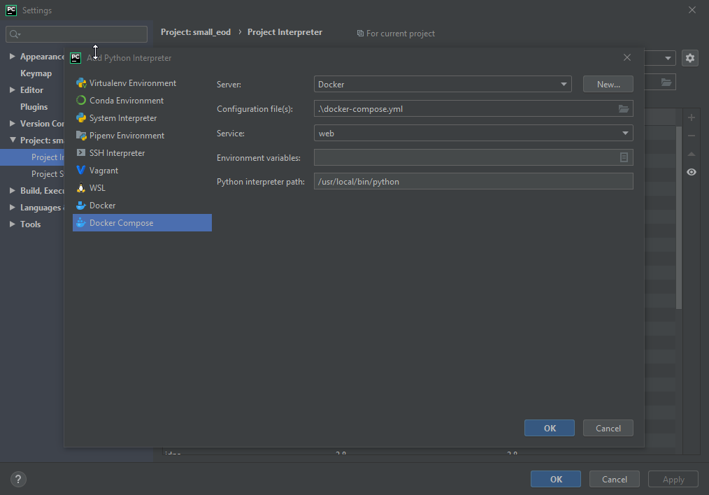

# PyCharm

Niektórzy z autorów projektu wykorzystują podczas rozwoju projektu edytor [Pycharm](https://www.jetbrains.com/help/pycharm/installation-guide.html#). Wskazują na skuteczność niezależnie od platformy z uwagi na dobrą integrację z oprogramowaniem [Dockerem](https://docs.docker.com/install/) i Git. Edytor automatycznie skonfiguruje repozytorium `git` i przełączy pliki na których aktualnie wykonywana jest praca (`git checkout`) nie tracąc poprzednich zmian.

Aby skonfigurować Pycharm z naszym środowiskiem należy wykonać następujące kroki:

## Skonfigurowanie `remote interpreter`

W przypadku błędów połączenia z serwerem Dockera upewnij się że konfiguracja TLS dla Dockera jest prawidłowa - jeśli wiesz co robisz, możesz ją po prostu wyłączyć.

Szczegółowa konfiguracja została przedstawiona na grafice:

## Konfiguracja  `path mappings`

Szczegółowa konfiguracja została przedstawiona na grafice:

## Podsumowanie

Po chwili od uruchomienia PyCharm wykona indeks plików, co po niedługim okresie umożliwi pracę z interaktywnym debuggerem i miłym środowiskiem pracy, co zostało przedstawione na grafice:

Warto także wskazać na możliwość skonfigurowania `default template` dla testów Django i zapoznać się [jak można pracować z PyCharm](./images/workflow.gif)
